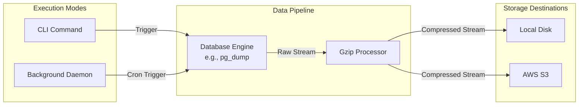

# Database Backup CLI

A robust, streaming command-line utility for database backups. This tool allows you to perform on-demand database backups or schedule them to run automatically in the background. It utilizes a streaming pipeline to capture data, compress it, and upload it directly to local or cloud storage without relying on large intermediate disk files.

## Features

* **Streaming Pipeline**: Captures backup output directly from the database engine and streams it through the processing pipeline.
* **On-the-fly Compression**: Compresses backup streams using Gzip before saving them.
* **Multiple Storage Destinations**:
  * Local File System
  * AWS S3
* **Background Scheduling**: A built-in daemon that runs recurring backups based on standard Cron expressions.
* **Structured Logging**: Uses standard `log/slog` for structured JSON logging, ideal for production monitoring.

## System Architecture



## Installation

Ensure you have Go 1.25 or later installed.

```bash
git clone https://github.com/Pointdexter37/Database-Backup-CLI.git
cd Database-Backup-CLI
go build -o dbbackup main.go
```

## Usage

### 1. On-Demand Backups

You can run an immediate backup using the `backup` command.

**Local Storage Example:**
```bash
./dbbackup backup \
  --db postgres \
  --name my_database \
  --host localhost \
  --user admin \
  --password secret \
  --output ./backups/my_database.sql \
  --compress=true \
  --storage local
```

**AWS S3 Storage Example:**
```bash
./dbbackup backup \
  --db postgres \
  --name my_database \
  --host localhost \
  --user admin \
  --password secret \
  --output backups/my_database.sql \
  --compress=true \
  --storage s3 \
  --s3-bucket my-backup-bucket \
  --s3-region us-east-1
```

### 2. Managing Schedules

You can configure backups to run automatically using standard Cron syntax (e.g., `0 2 * * *` for 2:00 AM daily).

**Adding a Schedule:**
```bash
./dbbackup schedule add \
  --cron "0 2 * * *" \
  --db postgres \
  --name my_database \
  --host localhost \
  --user admin \
  --password secret \
  --output ./backups/daily_backup.sql \
  --storage local
```

**Listing Schedules:**
```bash
./dbbackup schedule list
```

**Removing a Schedule:**
```bash
./dbbackup schedule remove --id <job-id>
```

### 3. Running the Daemon

To execute the scheduled backups, you must run the background daemon. The daemon will load the schedules from `schedules.json` and wait for the appropriate triggers.

```bash
./dbbackup daemon
```

All daemon activities and execution results are logged in JSON format to `backup_daemon.log` in the current working directory.

## Requirements

* **PostgreSQL**: The host machine running this CLI must have `pg_dump` installed and accessible in the system PATH to perform PostgreSQL backups.
* **AWS Credentials**: If using AWS S3 storage, ensure your environment is configured with valid AWS credentials (e.g., via `~/.aws/credentials` or environment variables like `AWS_ACCESS_KEY_ID` and `AWS_SECRET_ACCESS_KEY`).

## License

This project is open-source and available under the standard MIT License.
